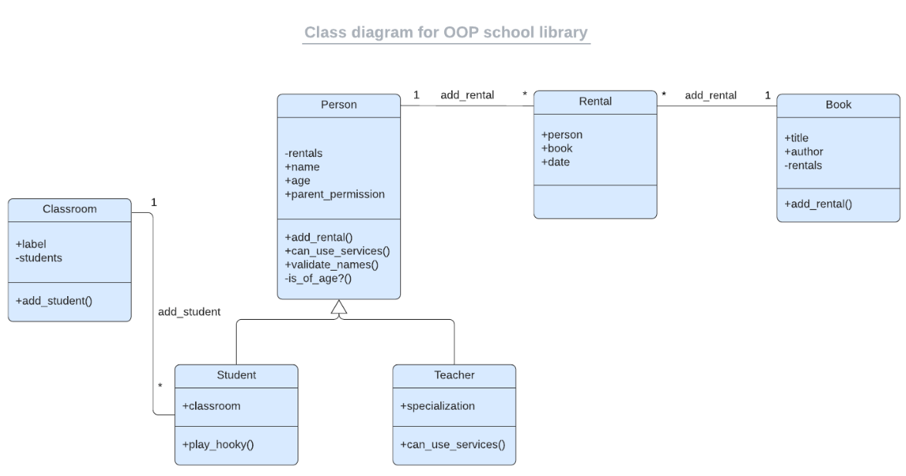

<a name="readme-top"></a>

<!-- TABLE OF CONTENTS -->

# 📗 Table of Contents

- [📗 Table of Contents](#-table-of-contents)
- [📖 School Library ](#-school-library-)
  - [🛠 Built With ](#-built-with-)
  - [🛠 Tech Stack ](#-tech-stack-)
    - [Key Features ](#key-features-)
  - [💻 Getting Started ](#-getting-started-)
    - [Prerequisites](#prerequisites)
    - [Setup](#setup)
    - [Install](#install)
    - [Usage](#usage)
  - [👥 Author](#-author)
  - [🔭 Future Features ](#-future-features-)
  - [🤝 Contributing ](#-contributing-)
  - [⭐️ Show your support ](#️-show-your-support-)
  - [🙏 Acknowledgments ](#-acknowledgments-)
  - [❓ FAQ ](#-faq-)
  - [📝 License ](#-license-)

<!-- PROJECT DESCRIPTION -->

# 📖 School Library <a name="about-project"></a>

>Imagine that you are the librarian of OOP University, and you need a tool to record what books are in the library and who borrows them. This app will allow you to:
>- Add new students or teachers.
>- Add new books.
>- Save records of who borrowed a given book and when


## 🛠 Built With <a name="built-with"></a>


## 🛠 Tech Stack <a name="tech-stack"></a>

<details>
  <summary>Client</summary>
  <ul>
    <li><a href="">Ruby</a></li>
  </ul>
</details>

<!-- Features -->

### Key Features <a name="key-features"></a>
>- Add new students or teachers.
>- Add new books.
>- Save records of who borrowed a given book and when

<p align="right">(<a href="#readme-top">back to top</a>)</p>

<!-- LIVE DEMO -->

<!-- ## 🚀 Live Demo <a name="live-demo"></a> -->

<!-- - [Not Available]() -->

<p align="right">(<a href="#readme-top">back to top</a>)</p>

<!-- GETTING STARTED -->

## 💻 Getting Started <a name="getting-started"></a>

To get a local copy up and running, follow these steps.

### Prerequisites

In order to run this project you need:

- Mac or PC
- Install Ruby
- Understanding of Ruby
- **IRB**
- **Gems to test linters**
- **RSpec to run tests**

### Setup

Clone this repository to your desired folder:

```sh
  cd into your-folder
 git clone https://github.com/admirerbrown/school_library.git
```

### Install

Install this project with:

- GitHub Actions
- Linters
- Rubocop
- Ruby

### Usage

- Use this project as a step to learning to practice building backend applications with Ruby and OOP concepts.
- >run "ruby main.rb from the terminal"

<p align="right">(<a href="#readme-top">back to top</a>)</p>

<!-- AUTHORS -->

## 👥 Author<a name="authors"></a>

👤 **Samuel Kyere**

- GitHub: [@admirerbrown](https://github.com/admirerbrown)
- Twitter: [@admirerbrown](https://twitter.com/brown_admirer)
- LinkedIn: [@samuelkyere](https://www.linkedin.com/in/samuel-ntow-kyere/)

<p align="right">(<a href="#readme-top">back to top</a>)</p>

<!-- FUTURE FEATURES -->

## 🔭 Future Features <a name="future-features"></a>

- [ ] **Build complete backend **
- [ ] extend the functionality to include calendar
- [ ] Add beautiful front-end interface

<p align="right">(<a href="#readme-top">back to top</a>)</p>

<!-- CONTRIBUTING -->

## 🤝 Contributing <a name="contributing"></a>

Contributions, issues, and feature requests are welcome!

Feel free to check the [issues page](https://github.com/admirerbrown/school_library/issues).

<p align="right">(<a href="#readme-top">back to top</a>)</p>

<!-- SUPPORT -->

## ⭐️ Show your support <a name="support"></a>

If you like this project, please leave a ⭐️

<p align="right">(<a href="#readme-top">back to top</a>)</p>

<!-- ACKNOWLEDGEMENTS -->

## 🙏 Acknowledgments <a name="acknowledgements"></a>

I would like to thank Microverse for providing us with reading materials that aided us to during the project development

<p align="right">(<a href="#readme-top">back to top</a>)</p>

<!-- FAQ (optional) -->

## ❓ FAQ <a name="faq"></a>

- **Can I use this code?**

  - yes, it is open source. Feel free to fork it.

- **Can I contribute to this project?**

  - Contact me so I can add you as a collaborator. Alternatively you can leave an issue, it will be well appreciated.

<p align="right">(<a href="#readme-top">back to top</a>)</p>

<!-- LICENSE -->

## 📝 License <a name="license"></a>

This project is [MIT](https://github.com/admirerbrown/school_library/blob/develop/LICENSE.md) licensed.

<p align="right">(<a href="#readme-top">back to top</a>)</p>
